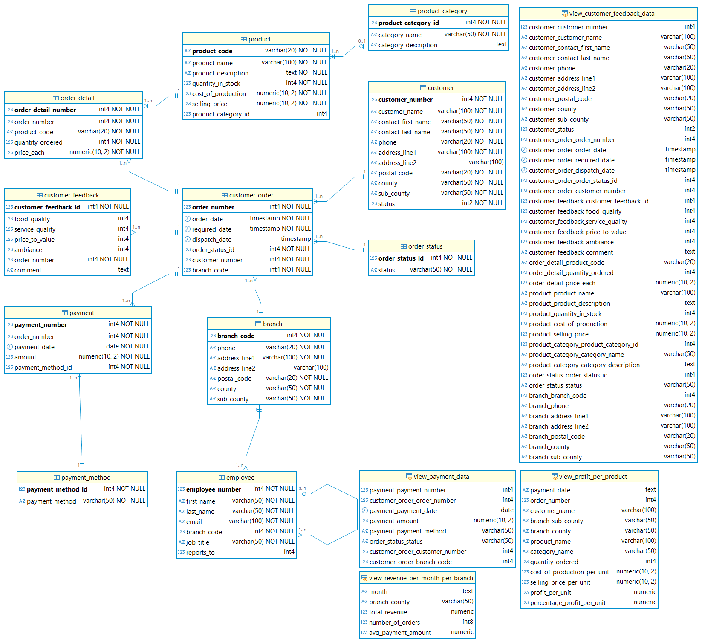

# Synthetic Data

## Overview

This lab uses the **Siwaka Dishes** database, which models a multi-branch Kenyan restaurant serving African food. The database includes tables for branches, employees, products, customers, customer orders, order details, payments, and customer feedback.

---

## Setting Up the Database

Open the connection to the PostgreSQL DBMS in the VM using pgAdmin. This was created in Part 1 of the lab when we were installing PostgreSQL (*Refer to:* [part_1_install_postgresql_in_ubuntu_server.md](part_1_install_postgresql_in_ubuntu_server.md)).

To do this, right-click on the `postgres` database and select `PSQL Tool` to open a new psql command line interface window.

You should see a screen like this:


**Step 1** — Use the synthetic data provided in the `data/202605` directory to create a new database and database accounts in PostgreSQL.

Refer to: [data/202605/0_a_DDL_siwaka_dishes_original.sql](data/202605/0_a_DDL_siwaka_dishes_original.sql) as the first file.

Copy and paste **line 1 to line 135 only** into the `psql` command line interface and execute them. This will create a new database called `siwaka_dishes`, create the necessary tables, and set up the user accounts.

**Step 2** — Connect to your new database using the `siwaka_dishes_db_admin` account.

Once you have created the database and setup the necessary user accounts, connect to the `siwaka_dishes` database using the `siwaka_dishes_db_admin` account. You can do this in pgAdmin by creating a new connection.

Right-click on `Servers` → `Create` → `Server...`

The connection details are as follows:

| Parameter | Value |
| --- | --- |
| Name | `siwaka_dishes_db_admin@ubuntu-26-04-VM:5432` |
| Host | Use the IP address of the VirtualBox Host-Only Adapter in the VM |
| Port | 5432 |
| Maintenance database | siwaka_dishes |
| Username | siwaka_dishes_db_admin |
| Password | (the password you set in the DDL script) |

Continue executing the remaining lines of the DDL script (**from line 155 to the end**) while connected to the `siwaka_dishes` database as `siwaka_dishes_db_admin`. This will create the tables in the `siwaka_dishes` database.

Refresh the server connection in pgAdmin, and navigate to the `siwaka_dishes` database. You should see the created tables under `Databases` → `siwaka_dishes` → `Schemas` → `public` → `Tables`.

**Step 3** — Load the data into the tables

The `data/202605` directory also contains SQL scripts to load the data into the tables. Execute the scripts in the order specified (alphabetical order based on the name of the file).

To do this, go to `Databases` → `siwaka_dishes` → `Schemas` → `public` → `Tables`, right-click on `Tables`, and select `Query Tool`. This will open a new query editor window.

Open each of the data loading SQL files (e.g., `1_a_DML_general_data.sql`, then `1_c_DML_employee_data.sql`, then `2_b_DML_customer_data.sql`, etc.) by selecting `Open File...` in the query editor, and then execute the contents of each file to load the data into the corresponding tables. Execute the contents by select the `Execute script` icon (play button) in the toolbar of the query editor.

This should be done one by one in the order of the files (alphabetical order based on the name of the file) to ensure that foreign key constraints are not violated.

**Step 4** — Verify the data has loaded

```sql
-- expect 20 rows
SELECT COUNT(*) AS number_of_branches__20 FROM branch;
-- expect 5 rows
SELECT COUNT(*) AS number_of_order_statuses__5 FROM order_status;
-- expect 11 rows
SELECT COUNT(*) AS number_of_payment_methods__11 FROM payment_method;
-- expect 11 rows
SELECT COUNT(*) AS number_of_product_categories__11 FROM product_category;
-- expect 20 rows total
SELECT COUNT(*) AS number_of_products__20 FROM product;
-- expect 56 rows total
SELECT COUNT(*) AS number_of_employees__56 FROM employee;
-- expect 300 rows total
SELECT COUNT(*) AS number_of_customers__300 FROM customer;
-- expect 2,500 rows total
SELECT COUNT(*) AS number_of_customer_orders__2500 FROM customer_order;
-- expect 5,010 rows total
SELECT COUNT(*) AS number_of_order_details__5010 FROM order_detail;
-- expect 6,776 rows total
SELECT COUNT(*) AS number_of_payments__6776 FROM payment;
-- expect 2,500 rows total
SELECT COUNT(*) AS number_of_customer_feedback__2500 FROM customer_feedback;
```

---

## Database Schema Reference

Familiarize yourself with the relations and their attributes.

Textual database schema:

```text
order_status      (order_status_id, status)

customer          (customer_number, customer_name, contact_first_name,
                   contact_last_name, phone, address_line1, address_line2,
                   postal_code, county, sub_county, status)

customer_order    (order_number, order_date, required_date, dispatch_date,
                   order_status_id, customer_number, branch_code)

order_detail      (order_detail_number, order_number, product_code,
                   quantity_ordered, price_each)

product           (product_code, product_name, product_description,
                   quantity_in_stock, cost_of_production, selling_price,
                   product_category_id)

product_category  (product_category_id, category_name, category_description)

payment           (payment_number, order_number, payment_date,
                   amount, payment_method_id)

payment_method    (payment_method_id, payment_method)

branch            (branch_code, phone, address_line1, address_line2,
                   postal_code, county, sub_county)

employee          (employee_number, first_name, last_name, email,
                   branch_code, job_title, reports_to)

customer_feedback (customer_feedback_id, food_quality, service_quality,
                   price_to_value, ambiance, order_number, comment)
```

**Foreign keys:**

| Attribute | References |
| --- | --- |
| `employee.branch_code` | `branch.branch_code` |
| `employee.reports_to` | `employee.employee_number` |
| `customer_order.order_status_id` | `order_status.order_status_id` |
| `customer_order.customer_number` | `customer.customer_number` |
| `customer_order.branch_code` | `branch.branch_code` |
| `product.product_category_id` | `product_category.product_category_id` |
| `payment.order_number` | `customer_order.order_number` |
| `payment.payment_method_id` | `payment_method.payment_method_id` |
| `order_detail.order_number` | `customer_order.order_number` |
| `order_detail.product_code` | `product.product_code` |
| `customer_feedback.order_number` | `customer_order.order_number` |

Graphical database schema:



---
